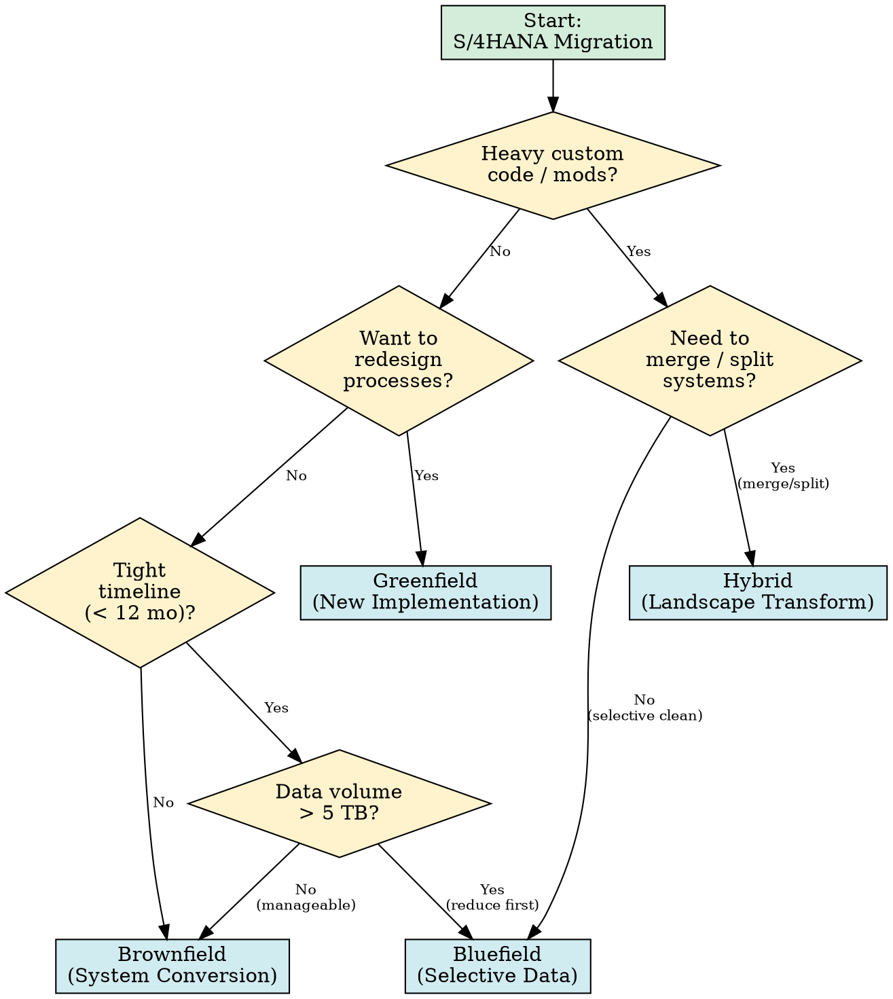

# S/4HANA Migration Reference

Comprehensive guidance for planning and executing SAP S/4HANA migrations.

## Content Routing

| User asks about… | Jump to |
|---|---|
| Which migration approach to pick | §1 Migration Approaches |
| Readiness or compatibility checks | §2 Readiness Checks |
| Custom code issues, ATC, ABAP Cloud | §3 Custom Code Remediation |
| SUM, DMC, Syniti, SNP tools | §4 Tools Overview |
| Data migration or data volume | §5 Data Migration Patterns |
| What changed in S/4HANA data model | §6 Simplification Items |
| Timeline, duration, planning | §7 Project Timeline |
| Decision help choosing an approach | §8 Decision Tree |

---

## §1 Migration Approaches

| Approach | Also known as | Description |
|---|---|---|
| **Brownfield** | System conversion | In-place technical conversion of existing ECC system to S/4HANA using SUM/DMO |
| **Greenfield** | New implementation | Fresh S/4HANA install; redesign processes, migrate master/transactional data selectively |
| **Bluefield** | Selective data transition | Combines elements of both; selectively migrates configuration and data using tools like SNP CrystalBridge or Syniti |
| **Hybrid** | Landscape transformation | Multiple source systems consolidated into one S/4HANA tenant |

### Pros and Cons

| Approach | Pros | Cons |
|---|---|---|
| **Brownfield** | Preserves history and customizations; shorter timeline; lower cost for clean systems | Carries forward technical debt; limited process redesign opportunity; complex if heavily modified |
| **Greenfield** | Clean slate; adopt best practices and Fiori UX; optimize processes | Longest timeline; highest cost; requires full data migration; business disruption |
| **Bluefield** | Selective carry-over; merge/split possible; balanced cost | Requires third-party tooling; complex scoping; less mature approach |
| **Hybrid** | Consolidates landscapes; reduces TCO long-term | Most complex; requires extensive coordination across systems |

---

## §2 Readiness Checks

Run these before committing to an approach:

### Simplification Item Check
- Execute the **SAP Readiness Check** (integrated in SAP for Me) against your system.
- Review SAP Note **2380257** — master list of simplification items per release.
- Each item flags: removed functionality, changed data models, required pre-conversion steps.

### Custom Code Analysis
- Run **ATC (ABAP Test Cockpit)** with the S/4HANA-specific check variant.
- Use the **Custom Code Migration Worklist** (transaction `SYCM`) to identify affected objects.
- Classify findings: must-fix before conversion vs. can-fix after.

### Data Volume Assessment
- Review table sizes: BSEG, MSEG, ACDOCA, BKPF, VBFA, CDHDR.
- S/4HANA merges tables (e.g., BSEG/BSIS/BSAS into ACDOCA) — estimate target table sizes.
- Plan archiving or data reduction before conversion to reduce downtime.

### Add-On Compatibility
- Check installed add-ons against the **Product Availability Matrix (PAM)**.
- Verify each add-on has an S/4HANA-compatible version or a replacement path.
- SAP-delivered industry solutions may require specific S/4HANA versions.

---

## §3 Custom Code Remediation

### ATC Checks
1. Configure the remote check scenario pointing to a reference S/4HANA system (SAP Note **2803646**).
2. Run ATC with check variant `S4HANA_READINESS` or `FUNCTIONAL_DB`.
3. Priority findings: direct DB access to removed/restructured tables, obsolete function modules, removed transactions.

### Custom Code Migration Worklist
- Transaction `SYCM` generates a worklist of all custom objects requiring changes.
- Categories: syntax errors, semantic changes, obsolete API usage.
- Export to spreadsheet for sprint planning; assign to development teams by module.

### ABAP Cloud Readiness
- If targeting ABAP Cloud (public cloud or clean core), restrict custom code to **Tier 1 (released APIs only)**.
- Use ABAP Cloud check variant in ATC to flag unreleased API usage.
- Replace direct table access with CDS views and released BAPIs/APIs.
- Key pattern: replace `SELECT * FROM BSEG` with `I_JournalEntry` CDS view consumption.

---

## §4 Tools Overview

| Tool | Purpose | Used in |
|---|---|---|
| **SUM (Software Update Manager)** | Executes the technical system conversion (DMO — Database Migration Option) | Brownfield |
| **Data Migration Cockpit (DMC)** | Template-based migration of master and transactional data using migration objects | Greenfield |
| **Migration Object Modeler** | Create or extend migration objects for DMC | Greenfield |
| **SAP Readiness Check** | Automated system scan: simplification items, add-ons, custom code | All approaches |
| **Syniti** (formerly BackOffice) | Selective data transition, data quality, data matching | Bluefield / Hybrid |
| **SNP CrystalBridge** | Selective data transition, system landscape transformation | Bluefield / Hybrid |
| **TDMS (Test Data Migration Server)** | Create reduced-size test systems from production data | Test preparation |

### SUM/DMO Key Points
- Performs in-place conversion and optional database migration (e.g., AnyDB to HANA) in one step.
- Downtime-optimized mode reduces cutover window via pre-processing.
- SUM version must match the target S/4HANA release — always check SAP Note **2313884**.

---

## §5 Data Migration Patterns

### Legacy-to-S/4HANA
- Use **Data Migration Cockpit** with standard migration objects (customers, vendors → business partners, materials, GL balances).
- Prepare data in staging files (XML or CSV); validate with dry-run imports.
- Business Partner migration is mandatory — vendor/customer master is replaced by BP model.

### SAP-to-SAP (ECC to S/4HANA)
- Brownfield: data converts in-place via SUM; no separate data migration needed.
- Bluefield: selective copy of configuration + chosen data subsets using SNP/Syniti.
- Greenfield from ECC: extract via custom extractors or SAP LSMW, load via DMC.

### Data Volume Management
- Archive historical data before conversion (use SAP ILM or standard archiving objects).
- Target: reduce BSEG, MSEG, CDHDR, VBFA to last 2–3 fiscal years where possible.
- Every 100 GB of data reduction saves approximately 1–2 hours of SUM downtime.

---

## §6 Simplification Items

Key data model and functional changes in S/4HANA:

| Area | What Changed | Impact |
|---|---|---|
| **Finance** | BSEG/BSIS/BSAS/BSIK/BSAK consolidated into ACDOCA (Universal Journal) | Custom reports on old tables must be rewritten |
| **Business Partner** | Customer (KNA1) and Vendor (LFA1) replaced by Business Partner (BUT000) | All custom code referencing customer/vendor master needs review |
| **Material Ledger** | Mandatory in S/4HANA; CKMLHD always active | Costing customizations require validation |
| **Credit Management** | Classic credit management replaced by SAP Credit Management (FIN-FSCM-CR) | Custom credit blocks and exits need rework |
| **Output Management** | NAST-based output replaced by BRF+ / Output Management | Custom print programs and driver programs affected |
| **MRP** | MRP Live (ppMRP) replaces classic MRP | Custom MRP user exits may need migration |

Refer to SAP Note **2380257** for the full list per release.

---

## §7 Project Timeline Considerations

### Typical Durations by Approach

| Approach | Small (<500 users) | Medium (500–5000) | Large (5000+) |
|---|---|---|---|
| **Brownfield** | 6–9 months | 9–14 months | 14–24 months |
| **Greenfield** | 9–14 months | 14–24 months | 24–36 months |
| **Bluefield** | 8–12 months | 12–18 months | 18–30 months |

### Critical Path Items
1. **Custom code remediation** — often the longest workstream; start during Explore phase.
2. **Data migration dry runs** — plan at least 3 full rehearsals before cutover.
3. **SUM technical conversion** — rehearse to measure downtime; optimize iteratively.
4. **Integration testing** — interfaces to non-SAP systems frequently break due to data model changes.
5. **Business Partner migration** — cross-functional impact (FI, MM, SD); start early.
6. **Training and change management** — Fiori UX is a significant shift for end users.

---

## §8 Decision Tree

Use this to guide approach selection:

---

## Key SAP Notes

| Note | Title | Use |
|---|---|---|
| **2380257** | Simplification Item List for S/4HANA | Master reference for data model and functionality changes per release |
| **2803646** | Custom Code Migration Guide | Setup of remote ATC checks and custom code migration worklist |
| **2313884** | S/4HANA Release Information | Release dates, maintenance windows, SUM compatibility |

## SAP Help Portal Links

- [SAP S/4HANA Migration Guide](https://help.sap.com/docs/SAP_S4HANA_ON-PREMISE/5765dcae1e8e4064b88a9e4c66c3ca73) — official conversion guide covering SUM, pre-checks, and post-steps.
- [Data Migration Cockpit](https://help.sap.com/docs/SAP_S4HANA_ON-PREMISE/39cbe824ba1e4e47a4361e69edb27f21) — migration objects, templates, and staging tables reference.
- [SAP Readiness Check](https://help.sap.com/docs/SAP_READINESS_CHECK) — automated assessment for S/4HANA transition readiness.
