# SAP Activate Methodology

## Content Routing

| User asks about… | Jump to |
|---|---|
| Phases, timeline, project structure | Phases Detail |
| Deliverables, documents, sign-offs | Key Deliverables per Phase |
| Quality gates, go/no-go criteria | Quality Gates |
| Workstreams, team structure | Workstreams |
| Cloud ALM, task management | SAP Cloud ALM Integration |
| Fit-to-Standard, workshops, gap analysis | Fit-to-Standard Workshops |

## 1. SAP Activate Overview

SAP Activate is an agile-waterfall hybrid methodology that replaced the legacy ASAP (Accelerated SAP) methodology. It is the standard implementation framework for SAP S/4HANA (cloud, on-premise, and hybrid) and SAP BTP solutions.

**Core principles:**

- **Guided configuration** over custom development — leverage SAP Best Practices and pre-delivered content
- **Iterative delivery** — sprints within a phase-gated structure to balance agility with governance
- **Fit-to-Standard** — adopt standard processes first, develop only where business-critical gaps exist
- **Continuous quality** — built-in quality gates between every phase

SAP Activate combines three accelerators: (1) SAP Best Practices (pre-configured content), (2) Guided Configuration (tooling), and (3) the Methodology itself (phases, deliverables, governance).

## 2. Phases Detail

```dot
digraph sap_activate {
    rankdir=LR;
    node [shape=box, style="filled,rounded", fontname="Arial", fontsize=10];
    edge [fontname="Arial", fontsize=9];

    Discover [fillcolor="#E3F2FD", label="Discover\n(Scope & Business Case)"];
    Prepare  [fillcolor="#FFF3E0", label="Prepare\n(Project Setup)"];
    Explore  [fillcolor="#E8F5E9", label="Explore\n(Fit-to-Standard)"];
    Realize  [fillcolor="#FCE4EC", label="Realize\n(Build & Test)"];
    Deploy   [fillcolor="#F3E5F5", label="Deploy\n(UAT & Go-Live)"];
    Run      [fillcolor="#E0F7FA", label="Run\n(Hypercare & Optimize)"];

    Discover -> Prepare [label="QG1"];
    Prepare  -> Explore [label="QG2"];
    Explore  -> Realize [label="QG3"];
    Realize  -> Deploy  [label="QG4"];
    Deploy   -> Run     [label="QG5"];
}
```

### Discover

**Goal:** Understand scope, build the business case, define high-level requirements.

- Identify business drivers and strategic objectives
- Document high-level process scope (L1/L2 process list)
- Evaluate deployment options (cloud, on-premise, hybrid)
- Perform vendor selection and solution demos
- Produce business case with ROI estimates and risk assessment
- Review SAP Best Practices and reference architectures

### Prepare

**Goal:** Establish project governance, standards, environments, and team readiness.

- Define project charter, RACI, and governance model
- Set up project tools (SAP Cloud ALM, Jira, Confluence)
- Provision system landscape (development, quality, production)
- Establish naming conventions, transport strategy, and coding standards
- Onboard project team (SAP training, methodology orientation)
- Activate SAP Best Practices content in the development system

### Explore

**Goal:** Validate standard processes, identify gaps, and build the backlog.

- Run Fit-to-Standard workshops (see Section 7)
- Perform gap analysis — classify each gap as configure, extend, or custom-develop
- Build a prioritized product backlog from confirmed gaps
- Define integration architecture and interface inventory
- Execute Sprint 0: team setup, CI/CD pipeline, Definition of Done
- Baseline the solution design document

### Realize

**Goal:** Iteratively build, configure, and test the solution in sprints.

- Sprint-based delivery (typically 2–3 week sprints)
- Configure standard processes; develop extensions (ABAP Cloud, BTP)
- Unit testing per story; integration testing per sprint
- String testing for end-to-end process chains
- Develop data migration programs and execute mock loads
- Build reports, forms, workflows, and role-based authorizations

### Deploy

**Goal:** Validate with business users, migrate data, and go live.

- User Acceptance Testing (UAT) with formal sign-off
- End-user training delivery (classroom, e-learning, quick reference cards)
- Final data migration (dress rehearsal + production cutover)
- Execute cutover runbook with rollback checkpoints
- Go-live authorization from steering committee
- Production smoke testing and transaction verification

### Run

**Goal:** Stabilize, optimize, and transition to steady-state operations.

- Hypercare support (typically 4–6 weeks post-go-live)
- Monitor KPIs, system performance, and batch job health
- Resolve production defects and capture change requests
- Conduct lessons-learned retrospective
- Transition support to Application Management Services (AMS)
- Plan continuous improvement roadmap (next release, phase 2 scope)

## 3. Key Deliverables per Phase

| Phase | Key Deliverables |
|---|---|
| Discover | Business case, L1/L2 process scope, solution architecture overview, vendor evaluation scorecard |
| Prepare | Project charter, RACI matrix, governance plan, system landscape diagram, transport strategy, onboarding plan |
| Explore | Fit-to-Standard workshop results, gap/delta list, backlog (user stories), solution design document, integration architecture |
| Realize | Configured system, custom developments (FS + TS), unit/integration test results, data migration scripts, training material drafts |
| Deploy | UAT sign-off, training completion records, cutover runbook, data migration reconciliation report, go-live approval |
| Run | Hypercare log, production issue tracker, KPI dashboard, lessons learned report, continuous improvement backlog |

## 4. Quality Gates

Each quality gate is a formal checkpoint; the project cannot proceed until criteria are met.

| Gate | Between | Must Be True to Proceed |
|---|---|---|
| QG1 | Discover -> Prepare | Business case approved, scope agreed, budget allocated, executive sponsor confirmed |
| QG2 | Prepare -> Explore | Systems provisioned, team onboarded, project plan baselined, governance in place |
| QG3 | Explore -> Realize | Fit-to-Standard complete, gaps classified and estimated, backlog prioritized, design authority sign-off |
| QG4 | Realize -> Deploy | All stories done (DoD met), integration tests passed, critical defects = 0, data migration dress rehearsal successful |
| QG5 | Deploy -> Run | UAT signed off, training delivered, cutover complete, go/no-go = GO, production smoke tests passed |

## 5. Workstreams

| Workstream | Responsibilities |
|---|---|
| **Project Management** | Planning, status reporting, risk/issue management, steering committee, budget tracking |
| **Change Management** | Stakeholder analysis, communication plan, training strategy, adoption monitoring |
| **Functional** | Process design, configuration, Fit-to-Standard workshops, functional specs |
| **Technical** | Custom development, integration, performance, basis/infrastructure, CI/CD |
| **Data Migration** | Data extraction, cleansing, mapping, load programs, reconciliation |
| **Testing** | Test strategy, test case design, execution, defect management, regression suites |

## 6. SAP Cloud ALM Integration

SAP Cloud ALM is the recommended tool for managing SAP Activate projects.

- **Requirements Management** — capture user stories and requirements from Fit-to-Standard, link to processes and test cases
- **Task Management** — plan sprints, assign tasks, track velocity; replaces or complements external tools
- **Test Management** — define test plans, execute manual and automated tests, record results, track defects
- **Deployment Management** — coordinate transports across the landscape (DEV -> QAS -> PRD), track feature delivery
- **Change and Release Management** — enforce transport sequencing, manage release calendars
- **Process Management** — model business processes, link to configuration, trace scope through to testing

Use Cloud ALM's built-in dashboards for quality gate reviews and steering committee reporting.

## 7. Fit-to-Standard Workshops

**What they are:** Structured sessions where SAP consultants demonstrate SAP Best Practice processes to business stakeholders. The goal is to identify where the standard fits and where gaps exist.

**How to run them:**

1. **Preparation** — activate relevant SAP Best Practice scope items in the demo/sandbox system; prepare process flow diagrams
2. **Demonstration** — walk through the standard end-to-end process (e.g., Order-to-Cash) in the live system
3. **Assessment** — business users rate each process step: Fit (accept as-is), Fit with Configuration (minor adjustment), or Gap (requires extension/custom development)
4. **Gap documentation** — for each gap, capture: business requirement, impact if not addressed, proposed solution approach, estimated effort
5. **Prioritization** — classify gaps as must-have (go-live), should-have (fast-follow), or nice-to-have (roadmap)

**Output:** A delta design document listing all gaps with their classification, which feeds directly into the product backlog for the Realize phase.

## References

- [SAP Activate Methodology — SAP Help Portal](https://help.sap.com/docs/SAP_ACTIVATE)
- [SAP Cloud ALM — SAP Help Portal](https://help.sap.com/docs/cloud-alm)
- SAP Press: *SAP Activate: Project Management for SAP S/4HANA* (Srivatsan Santhanam et al.)
- SAP Community: [SAP Activate Methodology Overview](https://community.sap.com/topics/activate-methodology)
