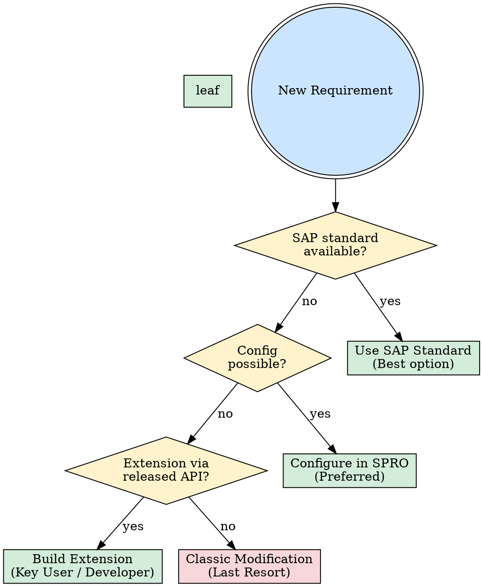

# SAP Brainstorming

Structured ideation for SAP work — think thoroughly, then build confidently.

<HARD-GATE>
Do NOT begin implementation (code, config, or transport) until the brainstorming checklist is complete and a solution approach is documented. Skipping brainstorming leads to rework, clean core violations, and missed standard functionality.
</HARD-GATE>

## Checklist

Complete these steps in order:

1. **Understand the business requirement** — What problem is being solved? Who is affected (end users, process owners, downstream systems)? Which SAP module or domain does this fall under?
2. **Classify the work** — Is this new development, enhancement of existing functionality, configuration change, or system integration? (see Classification Guide below)
3. **Explore SAP standard** — Does SAP already solve this out of the box? Check Fiori Apps Library, SAP Best Practices, and the product roadmap (see SAP Solution Exploration below)
4. **Assess clean core impact** — Can this be achieved without core modification? Are there released APIs, BAdIs, or extension points available? Will this survive an upgrade?
5. **Identify integration points** — Which systems are involved? What is the data flow direction? Is it real-time, near-real-time, or batch?
6. **Design the solution approach** — Propose at least two alternatives with trade-offs (see Decision Tree below)
7. **Estimate effort** — Use the `sap-estimation` skill for structured estimation with ranges and complexity factors
8. **Document decision** — Fill in the Architecture Decision Record template below with context, decision, alternatives considered, and consequences

## Classification Guide

| Type | Description | Example |
|------|-------------|---------|
| **New development** | Net-new functionality not in SAP | Custom Fiori app for field service |
| **Enhancement** | Extending existing SAP process | Adding custom fields to purchase order |
| **Configuration** | Using SPRO / standard settings | New plant, sales org, pricing procedure |
| **Integration** | Connecting SAP to external systems | CRM to S/4HANA order replication |

## Decision Tree: Solution Approach



## SAP Solution Exploration Checklist

Before proposing custom work, verify each of these sources:

- [ ] **Fiori Apps Library** — Search [fioriappslibrary.hana.ondemand.com](https://fioriappslibrary.hana.ondemand.com) for existing apps covering the requirement
- [ ] **SAP Best Practices** — Check SAP Best Practices Explorer for pre-configured process flows
- [ ] **SAP Roadmap** — Review [roadmaps.sap.com](https://roadmaps.sap.com) to see if SAP plans to deliver this capability soon
- [ ] **SAP Community / Blog Posts** — Search for similar use cases and proven approaches
- [ ] **SAP Notes & KBAs** — Check [me.sap.com/notes](https://me.sap.com/notes) for relevant notes and knowledge base articles
- [ ] **Released APIs** — Search the ABAP Cloud released objects list or SAP Business Accelerator Hub for available APIs

## Architecture Decision Record Template

Use this template to document the outcome of brainstorming:

```
## ADR: [Short Title]

### Status
[Proposed | Accepted | Deprecated | Superseded]

### Context
[What is the business requirement? What problem are we solving?
Which module/domain? Who are the stakeholders?]

### Decision
[What solution approach was chosen and why?]

### Alternatives Considered
| # | Alternative | Pros | Cons | Why Rejected |
|---|-------------|------|------|-------------|
| 1 | [option] | [pros] | [cons] | [reason] |
| 2 | [option] | [pros] | [cons] | [reason] |

### Clean Core Assessment
- Modification-free: [yes/no]
- Released APIs used: [list]
- Extension type: [key-user / developer / classic]
- Upgrade-safe: [yes/no]

### Integration Impact
- Systems involved: [list]
- Direction: [inbound / outbound / bidirectional]
- Pattern: [real-time API / near-real-time event / batch file / IDoc]
- Middleware: [Integration Suite / direct / other]

### Consequences
- [What are the positive outcomes?]
- [What are the risks or trade-offs?]
- [What follow-up actions are needed?]

### Effort Estimate
[Reference the sap-estimation skill output here]
```

## Cross-References

- **`sap-estimation`** — For structured effort estimation with SAP-specific complexity factors
- **`sap-code-review`** — When reviewing ABAP or Fiori code produced after brainstorming
- **`sap-troubleshooting`** — When debugging issues during implementation
- **`sap-go-live-readiness`** — When assessing whether the solution is ready for production
- **Module-specific skills** — Reference the relevant module skill (e.g., `sap-mm`, `sap-fi`, `sap-sd`) for domain-specific guidance when available
