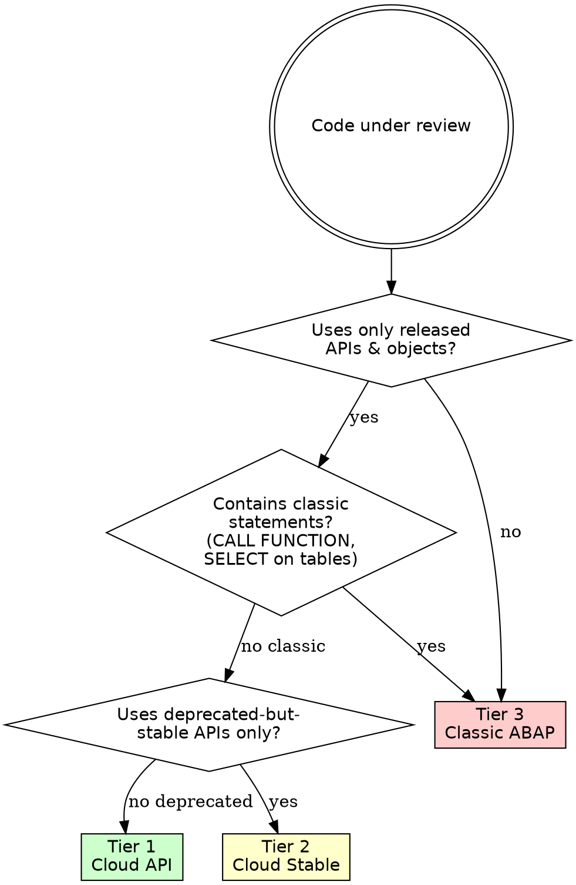

# SAP Code Review

Systematic SAP code review -- enforce clean core, catch anti-patterns, verify cloud-readiness.

<HARD-GATE>
Do NOT produce review findings until you have READ the code under review. Never review from memory or description alone. Load every file, then review.
</HARD-GATE>

## Checklist

You MUST complete these steps in order:

1. **Read all code** -- Load every file in scope (ABAP, CDS, metadata, UI5 views/controllers)
2. **Determine ABAP Cloud tier** -- Use the Decision Tree below to classify the codebase
3. **Check released API usage** -- Flag every unreleased SAP object (see Released vs Unreleased APIs)
4. **Apply clean core rules** -- Walk the compliance rules table row by row
5. **Scan for anti-patterns** -- Walk the anti-patterns table row by row
6. **Review RAP/CDS artifacts** -- If present, apply RAP/CDS criteria
7. **Review Fiori/UI5 artifacts** -- If present, apply Fiori/UI5 criteria
8. **Produce findings table** -- Output format MUST match the severity table below

## Decision Tree: ABAP Cloud Tier

## Clean Core Compliance Rules

| # | Rule | Violation Example | Correct Alternative |
|---|------|-------------------|---------------------|
| 1 | No direct SELECT on SAP tables | `SELECT * FROM bseg` | Use released CDS view `I_JournalEntryItem` |
| 2 | No classic function module calls | `CALL FUNCTION 'BAPI_...'` | Use released API class or RAP BO |
| 3 | No modification of SAP standard objects | User exits, implicit enhancements on standard | Use BAdIs or released extension points |
| 4 | No unreleased API usage | `cl_gui_alv_grid` (unreleased) | Use released `cl_salv_table` or RAP-based UI |
| 5 | No hardcoded SAP table key fields | `WHERE bukrs = '1000'` in custom code | Parameterize or use config tables |
| 6 | No obsolete statements | `MOVE x TO y`, `FORM/ENDFORM` | `y = x`, methods in classes |
| 7 | No WRITE-based reports | Classic list reporting | Use CDS + Fiori Elements or ALV IDA |
| 8 | Key user extensibility preferred | Custom fields via ABAP append | Use key user apps (Custom Fields & Logic) |

## Common Anti-Patterns

| Anti-Pattern | Why It Is Bad | Fix |
|-------------|---------------|-----|
| SELECT inside LOOP | N+1 query, severe performance hit | Collect keys, SELECT once before loop |
| SELECT * | Reads unnecessary columns, wastes memory | List explicit fields |
| Nested TRY/CATCH swallowing CX_ROOT | Hides real errors, impossible to debug | Catch specific exception classes |
| Hardcoded texts in ABAP | Not translatable, breaks i18n | Use message class or text elements |
| Single 10,000-line class | Untestable, unmaintainable | Split into focused classes, use composition |
| No unit tests | Regressions go undetected | Add ABAP Unit (cl_abap_unit_assert) |
| Using SY-SUBRC without checking | Silent failures | Always check SY-SUBRC after DB/FM calls |
| MODIFY dbtab FROM TABLE without checks | Data loss risk on key collisions | Validate before modify, use RAP BO |

## Released vs Unreleased APIs

SAP maintains a released object list (transaction `SE84` or ADT "Release Contract" column).

**How to verify:**
- In ADT: check the "API State" property -- must show "Released" (C1 contract)
- In S/4HANA: `SELECT * FROM i_apistateforeachreleasedobj` (itself a released CDS view)
- On-prem/private cloud: transaction SE84, filter by release state

**Key released CDS views (examples):**
- `I_BusinessPartner`, `I_Customer`, `I_Supplier`
- `I_SalesOrder`, `I_SalesOrderItem`
- `I_PurchaseOrder`, `I_PurchaseOrderItem`
- `I_JournalEntry`, `I_JournalEntryItem`
- `I_Product`, `I_ProductPlant`

**Key released API classes (examples):**
- `CL_BCS` (Business Communication Services)
- `CL_SALV_TABLE` (ALV output)
- `XCO_CP_*` (Extension Components library)

For a full catalog, see the SAP Business Accelerator Hub: https://api.sap.com

Cross-reference: the future `abap-cloud` reference skill will provide a searchable released object index.

## RAP/CDS Review Criteria

When RAP Business Objects or CDS views are in scope:

1. **CDS view naming** -- Custom views must use `Z` or `Y` prefix and follow `I_` (interface) / `C_` (consumption) / `R_` (restricted) conventions
2. **Annotations present** -- `@EndUserText.label`, `@ObjectModel`, `@Metadata.allowExtensions` as applicable
3. **Association cardinality** -- Verify `[0..*]`, `[1..1]` etc. match the data model
4. **Authorization control** -- `@AccessControl.authorizationCheck: #CHECK` with a proper DCL role
5. **Draft handling** -- If draft-enabled, verify `with draft` and `total etag` on root entity
6. **Determinations and validations** -- Business logic in RAP must use determinations/validations, not classic events
7. **Side effects** -- Annotated for Fiori to refresh dependent fields
8. **Projection consistency** -- Consumption projection must not expose fields hidden at interface level

## Fiori / UI5 Review Criteria

Brief checklist for Fiori Elements and freestyle UI5:

1. **Fiori Elements preferred** -- Use annotations-driven UI unless business justifies freestyle
2. **No direct OData model reads for SAP data** -- Use the RAP/CDS exposure; do not build custom OData
3. **i18n** -- All user-facing strings in `i18n.properties`, no hardcoded text in views/controllers
4. **CSP compliance** -- No inline scripts, no `eval()`
5. **Manifest-first** -- Routing, models, dependencies declared in `manifest.json`
6. **Async patterns** -- Promises or `async/await`; no synchronous XHR

## Output Format

Report ALL findings in this table format:

| # | Severity | File:Line | Finding | Recommendation |
|---|----------|-----------|---------|----------------|
| 1 | CRITICAL | file.abap:42 | Direct SELECT on BSEG | Use CDS view I_JournalEntryItem |
| 2 | WARNING | file.abap:78 | CALL FUNCTION (classic FM) | Use released class method |
| 3 | INFO | file.abap:15 | Missing error handling | Add TRY/CATCH for CX_... |

**Severity levels:**
- **CRITICAL** -- Breaks clean core compliance, blocks cloud migration, or causes data integrity risk
- **WARNING** -- Has a cloud-ready alternative that should be adopted; migration friction if left
- **INFO** -- Best practice improvement; not blocking but improves quality

After the table, provide:
- **Summary** -- Total counts by severity (e.g., 3 CRITICAL, 5 WARNING, 2 INFO)
- **Tier classification** -- The ABAP Cloud tier determined in step 2
- **Top recommendation** -- The single highest-impact change to make first
