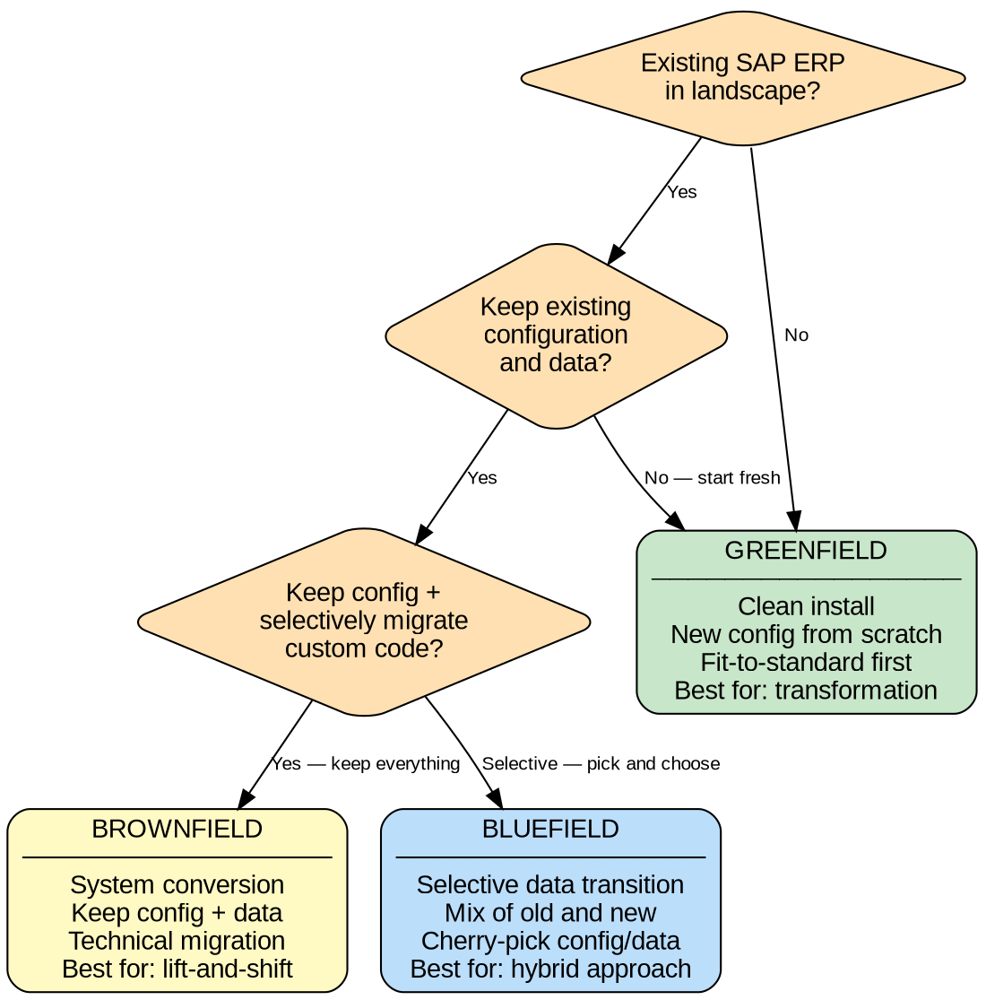

# SAP Project Kickoff

Structured project initiation for SAP — no plan without discovery, no execution without governance.

<HARD-GATE>
Do NOT produce a project plan, timeline, or resource allocation until ALL discovery items (Steps 1-7 in the Checklist) are completed. Every discovery item must be explicitly addressed with documented outputs. Skipping discovery leads to scope creep, blown budgets, and failed implementations.
</HARD-GATE>

## Checklist

### Phase 0 — Discover

1. **Define business drivers** — Why is this project happening? Document the top 3-5 business drivers and expected outcomes with measurable KPIs.
2. **Assess current landscape** — Inventory existing SAP and non-SAP systems, versions, custom code volume, interfaces, and integrations.
3. **Determine project approach** — Use the Decision Tree below to select greenfield, brownfield, or bluefield.
4. **Identify stakeholders** — Complete the Stakeholder Map and RACI matrix below.
5. **Conduct fit-to-standard workshops** — Map current business processes against SAP standard; log gaps.
6. **Estimate high-level scope and effort** — Use the `sap-estimation` skill for structured estimation with ranges.
7. **Document discovery findings** — Produce a Discovery Report summarizing drivers, landscape, gaps, risks, and recommendation.

### Phase 1 — Prepare

8. **Establish governance** — Set up steering committee, project team, and workstreams using the Governance Template below.
9. **Build project plan** — Define work packages, milestones, and timeline aligned to SAP Activate phases (see Timeline Template).
10. **Create risk register** — Populate the Risk Register Template with risks identified during discovery.
11. **Define solution architecture** — Document target landscape, deployment model (cloud/on-prem/hybrid), and integration architecture.
12. **Set up project infrastructure** — Provision SAP systems (sandbox, dev, QA, prod), Solman/Cloud ALM, transport routes, and CI/CD.
13. **Prepare data migration strategy** — Identify data objects, sources, cleansing requirements, and migration tooling (LTMC/BODS/SDI).
14. **Kick off change management** — Stakeholder communication plan, training needs assessment, organizational readiness baseline.
15. **Obtain Phase 1 sign-off** — Steering committee approves project charter, budget, timeline, and governance structure.

## Decision Tree — Project Approach

Use this decision tree to determine the implementation approach:



**Approach comparison:**

| Factor | Greenfield | Brownfield | Bluefield |
|--------|-----------|-----------|----------|
| Timeline | Longest (12-24 mo) | Shortest (6-12 mo) | Medium (9-18 mo) |
| Business disruption | High | Low | Medium |
| Process optimization | Maximum | Minimal | Selective |
| Data migration effort | Full migration | In-place conversion | Selective migration |
| Custom code | Rewrite or discard | Convert and adapt | Selectively migrate |
| Risk level | Medium-High | Medium | Medium |
| Cost | Highest | Lowest | Medium |

## Stakeholder Mapping

### Stakeholder Identification

| # | Name | Role | Department | Influence | Interest | Category |
|---|------|------|-----------|-----------|----------|----------|
| 1 | [name] | Executive Sponsor | [dept] | High/Med/Low | High/Med/Low | [see below] |
| 2 | [name] | Project Manager | [dept] | ... | ... | ... |
| 3 | [name] | Process Owner | [dept] | ... | ... | ... |
| 4 | [name] | Key User | [dept] | ... | ... | ... |
| 5 | [name] | IT Lead | [dept] | ... | ... | ... |

**Categories:** Manage Closely (high influence + high interest), Keep Satisfied (high influence + low interest), Keep Informed (low influence + high interest), Monitor (low influence + low interest).

### RACI Matrix

| Activity | Exec Sponsor | Proj Manager | Process Owner | Key User | IT Lead | SI Partner |
|----------|:---:|:---:|:---:|:---:|:---:|:---:|
| Project charter approval | A | R | C | I | C | C |
| Business process design | I | A | R | C | C | R |
| Solution architecture | I | A | C | I | R | R |
| Data migration strategy | I | A | C | C | R | R |
| Test planning | I | A | R | R | C | C |
| Change management | A | R | C | C | I | C |
| Go/No-Go decision | A | R | C | C | C | I |
| Budget approval | A | R | I | I | C | I |

*R = Responsible, A = Accountable, C = Consulted, I = Informed*

## Governance Structure Template

```
STEERING COMMITTEE (meets monthly)
├── Executive Sponsor (chair)
├── CFO / Budget Owner
├── Business Unit Heads
├── CIO / IT Director
└── SI Partner Director
    │
PROJECT MANAGEMENT OFFICE (meets weekly)
├── Project Manager (SAP customer side)
├── Project Manager (SI partner side)
├── Solution Architect
├── Change Management Lead
└── Quality Manager
    │
WORKSTREAMS (meet daily/weekly per sprint)
├── WS1: Finance (FI/CO/AA)
│   ├── Functional Lead
│   ├── Key Users (2-3)
│   └── Consultants (1-2)
├── WS2: Logistics (MM/SD/PP/WM)
│   ├── Functional Lead
│   ├── Key Users (2-3)
│   └── Consultants (1-2)
├── WS3: HCM / SuccessFactors
│   ├── Functional Lead
│   ├── Key Users (1-2)
│   └── Consultants (1-2)
├── WS4: Technical / Basis / Integration
│   ├── Technical Lead
│   ├── ABAP Developers
│   └── Integration Specialists
├── WS5: Data Migration
│   ├── Data Migration Lead
│   ├── Data Stewards (per domain)
│   └── ETL Developers
└── WS6: Change Management & Training
    ├── Change Management Lead
    ├── Training Coordinator
    └── Communication Specialist
```

## Risk Register Template

| # | Risk | Category | Probability | Impact | Score | Mitigation | Owner | Status |
|---|------|----------|:-----------:|:------:|:-----:|-----------|-------|--------|
| 1 | Key users unavailable for workshops | Resource | H | H | 9 | Secure formal time commitment from department heads | PM | Open |
| 2 | Scope creep from unclear requirements | Scope | H | H | 9 | Strict change control board; baseline scope in charter | PM | Open |
| 3 | Data quality issues delay migration | Data | M | H | 6 | Early data profiling in Phase 0; dedicated cleansing sprint | Data Lead | Open |
| 4 | Integration with legacy systems fails | Technical | M | H | 6 | Prototype critical interfaces in Phase 1 | Tech Lead | Open |
| 5 | Organizational resistance to change | People | M | M | 4 | Early stakeholder engagement; executive sponsorship | OCM Lead | Open |
| 6 | SI partner resource turnover | Resource | L | H | 3 | Knowledge transfer requirements in contract; documentation standards | PM | Open |
| 7 | Budget overrun | Financial | M | H | 6 | Monthly budget reviews; contingency reserve (15-20%) | Sponsor | Open |

*Probability: H=3, M=2, L=1. Impact: H=3, M=2, L=1. Score = Probability x Impact.*

## Timeline / Milestone Template

Aligned to SAP Activate methodology phases. Adjust durations based on `sap-estimation` skill output.

| Phase | Milestone | Target Date | Owner | Deliverables | Status |
|-------|----------|:-----------:|-------|-------------|--------|
| **Discover** | Discovery complete | T+6w | PM | Discovery report, approach decision, high-level business case | |
| **Prepare** | Project charter signed | T+10w | Sponsor | Charter, governance, budget, project plan | |
| **Prepare** | System landscape provisioned | T+12w | Tech Lead | Dev/QA/Prod systems, transport routes, Cloud ALM | |
| **Prepare** | Kickoff complete | T+12w | PM | All workstreams launched, team onboarded | |
| **Explore** | Fit-to-standard complete | T+20w | WS Leads | Delta design documents, backlog of gaps | |
| **Explore** | Solution design signed off | T+24w | Process Owners | Process flows, functional specs, integration design | |
| **Realize** | Sprint reviews (iterative) | T+24-44w | WS Leads | Configured system, developed objects, unit tested | |
| **Realize** | Integration testing complete | T+44w | QA Lead | Test results, defect resolution, interface validation | |
| **Realize** | UAT sign-off | T+48w | Process Owners | Signed UAT documents, residual defect plan | |
| **Deploy** | Go-live readiness confirmed | T+50w | PM | Use `sap-go-live-readiness` skill for gate verification | |
| **Deploy** | Go-live | T+52w | Sponsor | Production system live, hypercare active | |
| **Run** | Hypercare complete | T+56w | Support Lead | Stabilized system, handover to support | |

## Cross-References

- **`sap-estimation`** — Use for all effort and timeline estimates. Never give single-number estimates.
- **`sap-activate-methodology`** — Reference for detailed phase activities, deliverables, and quality gates.
- **`sap-go-live-readiness`** — Use during Deploy phase to verify all go-live gates pass before cutover.
