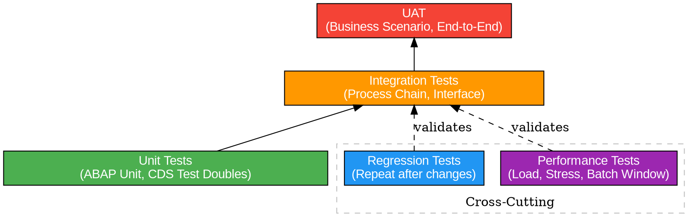

# SAP Testing Strategy

Structured approach to SAP testing — from scope definition through go/no-go reporting.

<HARD-GATE>
A test strategy MUST be defined and agreed upon BEFORE any test execution begins. Executing tests without a documented strategy leads to gaps, rework, and missed defects in production.
</HARD-GATE>

## Checklist

You MUST complete each step in order. Mark each as DONE, IN PROGRESS, or NOT STARTED:

1. **Define test scope** — Identify which business processes, SAP systems (ECC, S/4HANA, BTP, SuccessFactors, Ariba, etc.), and data sets are in scope. Document exclusions explicitly.
2. **Choose test levels** — Decide which levels apply: unit, integration, UAT, regression, performance. Not every project needs all levels — justify any exclusions.
3. **Design test cases** — Create test cases per business process covering both positive (happy path) and negative (error handling, edge cases) scenarios.
4. **Set up test data** — Prepare master data (materials, vendors, customers), transactional data (orders, invoices), and configuration (company codes, plants, org structure) in test systems.
5. **Execute tests** — Run test cases and track results as PASS, FAIL, or BLOCKED. A blocked test is one that cannot run due to missing prerequisites.
6. **Manage defects** — Classify by severity, prioritize, assign to owners, fix, and retest. No critical/high defects may remain open at go-live.
7. **Report results** — Produce a test summary report that feeds into the go/no-go decision (see `sap-go-live-readiness`, Gate 1: Functional Testing).

## SAP Testing Pyramid



**Read the pyramid bottom-up:**
- **Base (widest):** Unit tests catch code-level bugs early and cheaply.
- **Middle:** Integration tests verify that SAP modules, interfaces, and process chains work together.
- **Top (narrowest):** UAT confirms business scenarios work end-to-end from the user perspective.
- **Side:** Regression and performance tests cut across all levels and run after every change.

## SAP Test Tools

| Tool | Use For | Level |
|------|---------|-------|
| ABAP Unit | Code-level testing of ABAP classes, function modules, reports | Unit |
| CDS Test Doubles | Testing CDS views with mock data, no database dependency | Unit |
| eCATT | Automated functional test scripts, reusable test data containers | Integration |
| SAP Cloud ALM | Test planning, execution tracking, defect management | All |
| Tricentis | Automated end-to-end testing across SAP GUI, Fiori, and web | Integration / UAT |
| HP ALM / Jira | Defect tracking, test management, reporting dashboards | All |

## Test Case Template

Use this structure for every test case:

| Field | Description | Example |
|-------|-------------|---------|
| Test Case ID | Unique identifier | TC-MM-001 |
| Business Process | Process being tested | Procure-to-Pay |
| Test Scenario | What is being validated | Create purchase order with account assignment |
| Preconditions | What must exist before test runs | Vendor 10001 exists, material M-1000 in plant 1000 |
| Test Steps | Numbered steps to execute | 1. Open ME21N 2. Enter vendor 3. Add line item... |
| Expected Result | What should happen if system works correctly | PO created, status "Open", budget check passed |
| Test Type | Positive or Negative | Positive |
| Test Level | Unit / Integration / UAT | Integration |
| Priority | Critical / High / Medium / Low | High |
| Status | PASS / FAIL / BLOCKED / NOT RUN | NOT RUN |
| Actual Result | What actually happened | — |
| Defect ID | Link to defect if FAIL | — |
| Tested By | Tester name | — |
| Test Date | Execution date | — |

## Defect Severity Classification

| Severity | Definition | SAP-Specific Examples | SLA Target |
|----------|------------|----------------------|------------|
| **Critical** | System down or core process completely blocked; no workaround | Goods receipt crashes system; posting period locked incorrectly; IDoc processing halted for all partners | Fix within 4 hours |
| **High** | Major process impaired but workaround exists | Purchase order pricing incorrect; delivery creation fails for one plant; MRP run skips a material type | Fix within 24 hours |
| **Medium** | Minor process issue; business can continue | Report layout wrong; authorization missing for rarely used transaction; output form alignment off | Fix within 1 week |
| **Low** | Cosmetic or trivial; no business impact | Typo in field label; icon misaligned on Fiori tile; help text outdated | Fix in next sprint |

### Defect Lifecycle

```
New → Assigned → In Progress → Fixed → Retest → Closed
                                  ↓               ↓
                              Deferred         Reopened
```

- **New:** Tester logs the defect with severity, screenshots, and reproduction steps.
- **Assigned:** Development lead assigns to a developer.
- **In Progress:** Developer is actively working on the fix.
- **Fixed:** Fix transported to test system; ready for retest.
- **Retest:** Tester verifies the fix in the test system.
- **Closed:** Fix confirmed; defect resolved.
- **Reopened:** Retest failed; defect goes back to In Progress.
- **Deferred:** Accepted risk; documented workaround; moved to post-go-live backlog.

## Test Execution Tracking

Track progress daily using these metrics:

| Metric | Formula | Target |
|--------|---------|--------|
| Execution rate | (Executed / Total) x 100 | 100% before go/no-go |
| Pass rate | (Passed / Executed) x 100 | > 95% |
| Defect density | Open defects / Test cases executed | < 5% |
| Critical/High open | Count of Sev 1 + Sev 2 open defects | 0 at go-live |
| Blocked rate | (Blocked / Total) x 100 | < 5% |

## Test Data Strategy

### Master Data Checklist

- [ ] Organizational structure (company codes, plants, sales orgs, purchasing orgs)
- [ ] Business partners / vendors / customers with relevant account groups
- [ ] Materials with all required views (accounting, purchasing, sales, MRP)
- [ ] G/L accounts, cost centers, profit centers, WBS elements
- [ ] Pricing conditions, output conditions, partner determination

### Transactional Data Checklist

- [ ] Open purchase orders and sales orders for process continuation tests
- [ ] Posted invoices and payments for reconciliation tests
- [ ] Inventory balances for goods movement tests
- [ ] Open deliveries for shipping tests

### Golden Rule

> Test data must mirror production complexity. A test with 1 line item does not validate a process that runs with 500 line items in production.

## Cross-Reference: Go-Live Readiness

This skill feeds directly into **`sap-go-live-readiness`**, specifically:

- **Gate 1: Functional Testing** — requires test case execution report, zero critical/high open defects, and regression suite passing.
- **Gate 2: Integration Testing** — requires all interfaces tested end-to-end with realistic volumes.
- **Gate 3: UAT Sign-Off** — requires formal sign-off from business process owners based on UAT results.
- **Gate 4: Performance Testing** — requires load/stress test results within SLA thresholds.

Do not proceed to go/no-go without completing the test summary report from Step 7 of this checklist.

## Test Summary Report Template

The final deliverable of this process:

| Section | Content |
|---------|---------|
| Scope | Systems, processes, and data covered |
| Test levels executed | Which levels were run and why |
| Execution summary | Total / Passed / Failed / Blocked counts |
| Open defect summary | By severity with owner and ETA |
| Risk assessment | Residual risks from deferred defects |
| Recommendation | GO, NO-GO, or CONDITIONAL GO with conditions |
| Sign-off | Test lead, business process owners, project manager |
