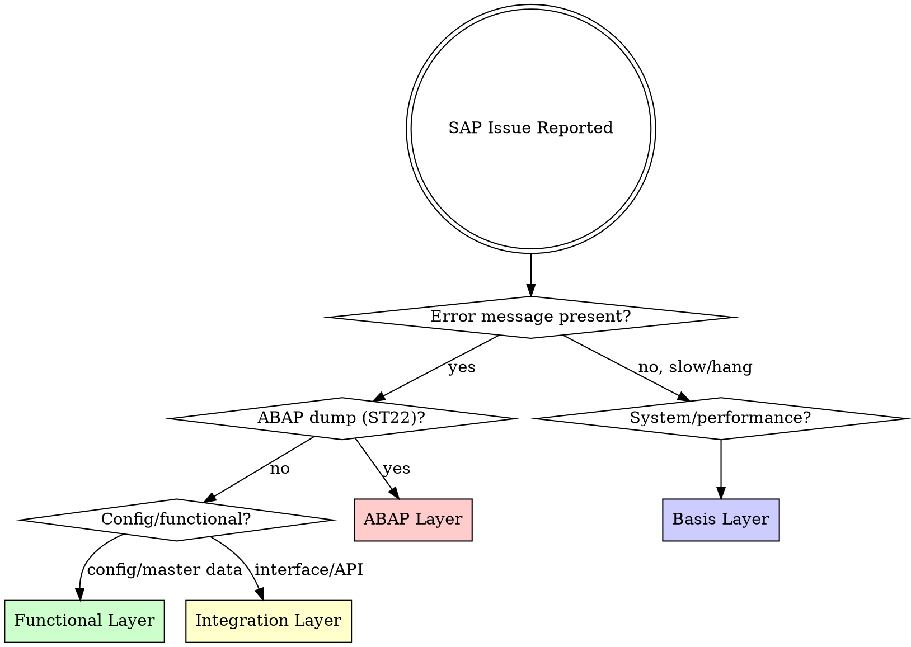

# SAP Troubleshooting

Systematic SAP debugging — never guess, always diagnose.

<HARD-GATE>
Do NOT suggest fixes until you have completed the diagnosis checklist. Guessing wastes hours. Diagnosis saves hours.
</HARD-GATE>

## Checklist

You MUST complete these steps in order:

1. **Capture the symptom** — Exact error message, transaction code, user, timestamp
2. **Classify the issue** — Which layer? (see Decision Tree below)
3. **Gather evidence** — Logs, traces, dumps for that layer
4. **Search knowledge** — SAP Notes, KBAs, community threads
5. **Identify root cause** — Based on evidence, not assumption
6. **Propose fix** — With rollback plan
7. **Verify fix** — Test in dev/QA before transport

## Decision Tree: Which Layer?

## Layer-Specific Diagnosis

### ABAP Layer
1. **ST22** — Read the short dump. Note: exception class, triggering program, line number
2. **SE24/SE80** — Check the code at the failing line
3. **ST05** — SQL trace if database-related
4. **SAT** — Runtime analysis if performance-related
5. Check clean core compliance (future: `abap-cloud` reference skill)

### Basis Layer
1. **SM21** — System log for errors/warnings around the timestamp
2. **ST06** — OS monitor for CPU/memory/disk
3. **SM50/SM66** — Work process overview for hangs/locks
4. **ST04** — Database performance (expensive SQLs)
5. **SM12** — Lock entries if users report "locked" errors
6. Check system configuration (future: `system-administration` reference skill)

### Functional Layer
1. **Identify the process** — Which business process failed? (order, invoice, posting, etc.)
2. **Check config** — SPRO path for the relevant area
3. **Check master data** — Is the master data complete and consistent?
4. **Check customizing** — Are condition records, pricing, determination rules correct?
5. Check module-specific configuration (future: module reference skills)

### Integration Layer
1. **SLT / Integration Suite monitoring** — Check message status
2. **SM58** — tRFC/qRFC errors
3. **SOAMANAGER** — Web service errors
4. **Cloud Connector** — Connection status for BTP integration
5. Check integration configuration (future: `sap-integration-suite` reference skill)

## SAP Notes Search Pattern

When searching for SAP Notes:
1. Use the exact error message text (in quotes)
2. Include the component (e.g., FI-GL, MM-PUR, BC-SRV)
3. Filter by S/4HANA version if applicable
4. Check "Correction Instructions" notes first — they often contain the fix
5. Link: https://me.sap.com/notes

## Common Patterns

| Symptom | Likely Cause | First Check |
|---------|-------------|-------------|
| "No authorization" | Missing role/auth object | SU53 (last auth check) |
| ABAP dump MESSAGE_TYPE_X | Intentional exception in code | ST22 → read the message |
| Posting period not open | OB52 config | Check fiscal year variant |
| IDoc stuck | Partner profile or port config | WE19/WE20 |
| Batch job failed | Job log in SM37 | SM37 → job log → spool |
| Performance slow after upgrade | Missing index or stats | ST05 trace → ST04 |

## After Resolution

- Document the root cause and fix
- Create transport if config/code change
- Update team knowledge base
- Check if SAP Note exists (create CSS message if not)
