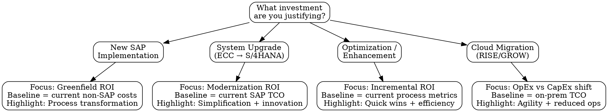

# SAP Value Advisory

<HARD-GATE>
STOP. Before building ANY business case, ROI model, or investment justification:

You MUST complete the current-state assessment (Step 1) first. No financial modeling without understanding the baseline.

Required before proceeding:
- [ ] Current pain points documented with quantified impact
- [ ] Existing cost baseline established (infrastructure, licenses, FTEs, manual processes)
- [ ] Stakeholder expectations captured (what does success look like?)
- [ ] Scope boundaries defined (which processes/modules/regions)

If any of these are missing, STOP and gather them first.
</HARD-GATE>

## Checklist

1. **Current State Assessment** — Document pain points, inefficiencies, manual processes, and establish cost baseline
2. **Value Driver Identification** — Map improvement opportunities to value categories
3. **Quantification Methodology** — Calculate expected benefits using bottom-up analysis and benchmarks
4. **TCO Modeling** — Build total cost of ownership across all cost categories
5. **ROI Calculation** — Compute NPV, payback period, IRR with sensitivity analysis
6. **Risk-Adjusted Business Case** — Create optimistic/realistic/conservative scenarios
7. **Executive Presentation** — Build C-suite-ready narrative with one-page summary
8. **Value Realization Tracking** — Define post-go-live KPIs and achievement reporting

---

## Business Case Type Decision Tree



---

## Value Driver Categories

| Category | Examples | Typical Range | How to Quantify |
|----------|---------|---------------|----------------|
| **Process Efficiency** | Reduced cycle times, automation, fewer manual steps | 20-40% improvement | Time studies, process mining, transaction counts |
| **Cost Reduction** | Infrastructure consolidation, FTE reallocation, license savings | 15-30% savings | Current spend analysis, vendor quotes |
| **Revenue Enablement** | Faster time-to-market, better analytics, improved CX | 5-15% uplift | Pipeline data, conversion rates, time-to-quote |
| **Risk Mitigation** | Compliance automation, audit readiness, security | Use avoidance costs | Penalty rates, audit findings, breach costs |
| **Working Capital** | Inventory optimization, DSO/DPO improvement | 10-25% improvement | Current vs target ratios, cash flow modeling |
| **Innovation** | New business models, real-time insights, AI/ML capabilities | Strategic — hard to quantify | Competitive benchmarks, market opportunities |

**Rule of thumb:** Lead with the top 3-5 value drivers that matter most to *this* stakeholder. Don't list everything.

---

## TCO Components

| Cost Category | One-Time | Recurring | Often Missed |
|--------------|----------|-----------|-------------|
| **Software Licenses** | Initial license fees | Annual maintenance / subscription | True-up costs, user growth |
| **Implementation** | SI partner fees, internal team | — | Scope creep contingency (15-25%) |
| **Infrastructure** | Hardware, migration tools | Hosting, cloud compute, storage | DR/HA environments, dev/test systems |
| **Data Migration** | ETL tooling, data cleansing | — | Multiple mock migrations, data quality |
| **Change Management** | Training development | Ongoing training, support desk | Productivity dip (3-6 months post-go-live) |
| **Operations** | — | Basis/admin FTEs, L1-L3 support | Managed service vs internal staffing |
| **Opportunity Cost** | — | — | Business disruption during implementation |
| **Decommissioning** | Legacy system shutdown | — | Data archiving, license termination fees |

> Cross-reference: Use `rise-licensing` skill for RISE/GROW-specific licensing cost structures.

---

## ROI Calculation Templates

### Simple ROI
```
ROI = (Total Benefits over N years - Total Costs over N years) / Total Costs × 100

Example:
  Benefits (3yr): $4.5M
  Costs (3yr):    $2.8M
  ROI = ($4.5M - $2.8M) / $2.8M × 100 = 60.7%
```

### Net Present Value (NPV)
```
NPV = Σ (Net Cash Flow_t / (1 + r)^t) - Initial Investment

Where:
  r = discount rate (typically 8-12% for SAP projects)
  t = year (0, 1, 2, ... N)

Rule: NPV > 0 = project is financially viable
```

### Payback Period
```
Payback Period = Year where cumulative net cash flow turns positive

| Year | Investment | Benefits | Net | Cumulative |
|------|-----------|----------|-----|-----------|
| 0    | -$2.0M    | $0       | -$2.0M | -$2.0M |
| 1    | -$0.5M    | $0.8M    | $0.3M  | -$1.7M |
| 2    | -$0.3M    | $1.5M    | $1.2M  | -$0.5M |
| 3    | $0        | $1.8M    | $1.8M  | $1.3M  | ← Payback in Year 3
```

### Sensitivity Analysis
```
Test: What if benefits are 20% lower than estimated?

| Scenario | Benefits | Costs | ROI | NPV | Payback |
|----------|----------|-------|-----|-----|---------|
| Optimistic (+20%) | $5.4M | $2.8M | 92.9% | $1.8M | 2.1 yr |
| Realistic (base) | $4.5M | $2.8M | 60.7% | $1.2M | 2.8 yr |
| Conservative (-20%) | $3.6M | $2.8M | 28.6% | $0.5M | 3.5 yr |
| Worst case (-40%) | $2.7M | $2.8M | -3.6% | -$0.2M | >5 yr |
```

---

## SAP-Specific Benchmarks & Tools

| Resource | What It Provides |
|----------|-----------------|
| **SAP Value Lifecycle Manager (VLM)** | Industry benchmarks, value driver library, KPI mapping — available to SAP partners |
| **SAP Business Case Builder** | Template-driven business case with SAP-specific assumptions |
| **SAP Signavio Process Intelligence** | Data-driven current-state analysis from actual system logs |
| **SAP Cloud ALM** | Post-go-live KPI tracking aligned to business case metrics |
| **Industry benchmarks** | APQC, Hackett Group, Gartner — process cost benchmarks by industry |

### Typical SAP Project ROI Ranges (Industry Data)

| Project Type | Typical ROI (3-year) | Typical Payback |
|-------------|---------------------|-----------------|
| New S/4HANA implementation | 80-200% | 2-4 years |
| ECC to S/4HANA conversion | 50-150% | 2-3 years |
| RISE with SAP migration | 30-100% | 2-4 years |
| Module optimization | 100-300% | 6-18 months |
| BTP extension project | 150-400% | 3-12 months |

*Ranges vary significantly by industry, company size, and scope.*

---

## Executive Presentation Structure

### One-Page Executive Summary Template

```
┌─────────────────────────────────────────────┐
│  INVESTMENT RECOMMENDATION: [Project Name]  │
├─────────────────────────────────────────────┤
│  THE CHALLENGE                              │
│  • [Pain point 1 with $$ impact]            │
│  • [Pain point 2 with $$ impact]            │
│  • [Pain point 3 with $$ impact]            │
├─────────────────────────────────────────────┤
│  THE SOLUTION                               │
│  [2-3 sentence description]                 │
├─────────────────────────────────────────────┤
│  FINANCIAL SUMMARY                          │
│  Investment: $X.XM | ROI: XX% | Payback: Xyr│
│  NPV: $X.XM (@ X% discount rate)           │
├─────────────────────────────────────────────┤
│  TOP VALUE DRIVERS          │ RISK FACTORS  │
│  1. [Driver] → $XXK/yr      │ • [Risk 1]   │
│  2. [Driver] → $XXK/yr      │ • [Risk 2]   │
│  3. [Driver] → $XXK/yr      │ • [Mitigation]│
├─────────────────────────────────────────────┤
│  RECOMMENDATION: [Proceed / Defer / Reject] │
│  DECISION NEEDED BY: [Date]                 │
└─────────────────────────────────────────────┘
```

### Presentation Flow (for 30-minute C-suite meeting)

| Section | Time | Content |
|---------|------|---------|
| Business context | 5 min | Why now? Market pressure, competitive risk, compliance deadline |
| Current state pain | 5 min | Top 3 pain points with dollar impact — make it personal |
| Solution overview | 5 min | What we're proposing (high level, not technical) |
| Financial case | 10 min | Investment, ROI, payback, sensitivity — lead with the number |
| Risk & mitigation | 3 min | Top risks, how we'll manage them |
| Ask & next steps | 2 min | Clear decision request with timeline |

---

## Value Realization Tracking

After go-live, track whether the business case delivers:

| KPI Category | Example KPIs | Measurement Method | Frequency |
|-------------|-------------|-------------------|-----------|
| Process efficiency | Order-to-cash cycle time, days to close | SAP process mining, transaction logs | Monthly |
| Cost reduction | IT infrastructure spend, FTE allocation | Finance actuals vs budget | Quarterly |
| Revenue impact | Quote-to-order conversion, time-to-market | CRM + SAP pipeline data | Quarterly |
| Working capital | DSO, DIO, DPO | SAP FI reports | Monthly |
| User adoption | Active users, transaction volumes, help desk tickets | SAP Cloud ALM, support system | Monthly |

> Cross-reference: Use `sap-go-live-readiness` for pre-go-live gates. Value realization starts at Gate 10 (Post-Go-Live Review).

---

## Common Mistakes

| Mistake | Why It Fails | Fix |
|---------|-------------|-----|
| Benefits without baseline | "Save 30%" means nothing without current cost | Always quantify current state first |
| Ignoring change management costs | 15-25% of project cost, often cut first | Include in TCO, protect the budget |
| Over-optimistic timelines | Compressed timelines increase cost, reduce benefits | Use `sap-estimation` for realistic estimates |
| Single scenario | One number is easy to challenge | Always present 3 scenarios |
| Technical focus to C-suite | Executives care about business outcomes | Lead with $$ impact, not system features |
| Forgetting value realization | Business case dies after approval | Build tracking into project plan from day 1 |

---

## Related Skills

- `sap-estimation` — Effort and cost estimation inputs for TCO
- `sap-project-kickoff` — Scoping and stakeholder alignment
- `rise-licensing` — RISE/GROW licensing cost structures
- `sap-go-live-readiness` — Post-go-live value realization gates
- `sap-change-management` — Change management cost and value tracking
